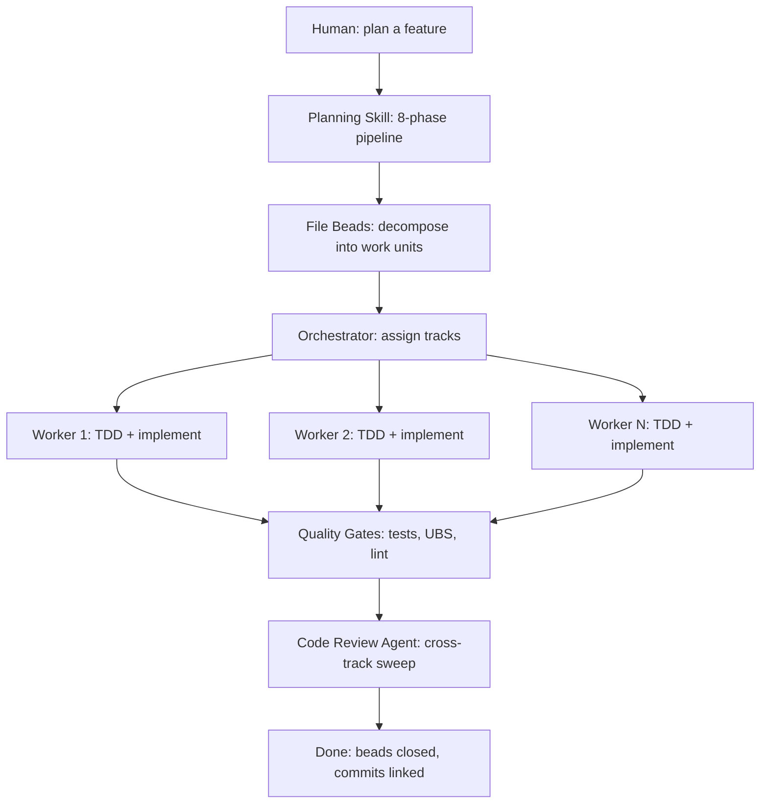
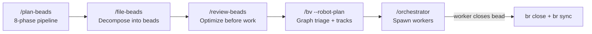

# Claude Code Utils

A plugin marketplace for [Claude Code](https://docs.anthropic.com/en/docs/claude-code) — custom skills, agents, and commands organized as installable plugins.

## Install

In Claude Code session:

```bash
/plugin marketplace add trungtnm/claude-code-utils
/plugin install ccu
```

For local development, see [DEVELOPMENT.md](DEVELOPMENT.md).

## Why

Claude Code is powerful out of the box, but teams hit the same gaps repeatedly: no enforced TDD, no structured planning pipeline, no quality gates before commits, no multi-agent coordination. This plugin fills those gaps with opinionated, composable building blocks — each one a distilled workflow you'd otherwise hand-write into `CLAUDE.md` files across every project.

**Who benefits:**
- **Solo developers** — get code review, security scanning, and bug detection without a second pair of eyes
- **Teams using Claude Code** — standardize on shared coding standards, planning processes, and quality gates
- **Multi-agent workflows** — coordinate parallel workers on large features via the orchestrator + beads system

## Skills

| Skill | Description |
|-------|-------------|
| `/plan-beads` | Feature planning and execution plan generation |
| `/brainstorming` | Idea-to-design process, hard-gates implementation |
| `/test-driven-development` | Write-tests-first methodology |
| `/ubs` | Ultimate Bug Scanner: 18 detection categories, 8 languages |
| `/dcg` | Destructive Command Guard: blocks dangerous commands |
| `/security-review` | Security checklist for auth, input, secrets, APIs |
| `/qa-sweep` | Three-phase quality sweep (inspect, review, polish) |
| `/coding-standards` | TypeScript/JavaScript/React/Node.js standards |
| `/orchestrator` | Spawn and monitor parallel workers (haiku coordinator) |
| `/file-beads` | File detailed Beads epics and issues from a plan |
| `/review-beads` | Review and refine filed Beads issues |
| `/docs-seeker` | Discover docs via llms.txt, Repomix, parallel exploration |
| `/context-engineering` | AI agent architecture and memory system patterns |
| `/frontend-patterns` | React, Next.js, state management patterns |
| `/backend-patterns` | Node.js, Express, Next.js API route patterns |
| `/vercel-react-best-practices` | Vercel Engineering optimization guidelines |
| `/web-design-guidelines` | Web Interface Guidelines compliance review |
| `/design-md` | Semantic design system synthesis |
| `/reactcomponents` | Vite/React component generation from designs |
| `/stitch-loop` | Iterative website building with Stitch |
| `/writing-skills` | Create, edit, and verify skills |
| `/using-skills` | Skill discovery and usage conventions |
| `/cass` | Coding Agent Session Search across multiple agents |
| `/cm` | CASS Memory: procedural memory with confidence decay |
| `/br` | Beads Rust issue tracker: create, triage, dependencies, sync |
| `/bv` | Beads Viewer: graph-aware triage engine with PageRank and critical path |
| `/bd-to-br-migration` | Beads migration utilities |

## Agents

| Agent | Description |
|-------|-------------|
| **TDD Guide** | Test-driven development enforcement |
| **Code Reviewer** | Quality, security, maintainability review |
| **Security Reviewer** | OWASP Top 10, secrets, injection detection |
| **Worker** | Bead implementation agent (opus, TDD-first) |
| **Oracle** | Advisory consultant for complex reasoning (read-only) |
| **Architect** | System design and scalability decisions |
| **Database Reviewer** | PostgreSQL optimization, Supabase practices |
| **Build Error Resolver** | TypeScript/build error fixes (minimal diffs) |

## Commands

Session commands (`t:` prefix) are single-purpose instruction scripts that drive specific workflow phases. They accept optional `$ARGUMENTS` to scope their work — without arguments they fall back to a broad sweep.

### Orientation & Planning

| Command | Purpose |
|---------|---------|
| `t:prime` | Deep-read all project docs and fully orient before acting |
| `t:top-ideas` | Generate the 10 most impactful feature ideas |
| `t:opinion` | Get an honest, critical assessment of the project |

```bash
# New to a codebase? Orient first, then immediately start the agent auto
/t:prime /t:auto

# Orient, then review the DEVELOPMENT.md for improvements
/t:prime review @DEVELOPMENT.md and suggest improvements

# Brainstorm features — run 3+ times and the best ideas compound
/t:top-ideas
/t:top-ideas focus on developer experience

# Sanity-check your project direction before investing more time
/t:opinion
```

### Implementation & Review

| Command | Purpose |
|---------|---------|
| `t:auto` | Register with Agent Mail, check inbox, and work through beads |
| `t:peer-review` | Review code written by other agents or contributors |
| `t:fresh-eyes` | Re-read session code and catch bugs with fresh perspective |
| `t:random-inspect` | Randomly explore code files, trace flows, fix issues |
| `t:rootfix` | Diagnose and fix root causes — no bandaid fixes |
| `t:remove-stub` | Find and replace all stubs, placeholders, and TODOs |

```bash
# Launch an autonomous agent that picks up beads and works through them
/t:auto

# After an agent swarm finishes, review what a specific worker produced
/t:peer-review a02-1a2b

# Finished a burst of coding? Re-read everything with fresh eyes
/t:fresh-eyes

# Spot-check random parts of the codebase for hidden issues
/t:random-inspect src/lib

# A test is failing and you can't figure out why — find the root cause
/t:rootfix TypeError: Cannot read property 'id' of undefined

# Clean up after a prototype sprint — replace all TODOs and stubs with real code
/t:remove-stub
```

### Polish & Documentation

| Command | Purpose |
|---------|---------|
| `t:polish` | Scrutinize UI/UX and implementation for quality |
| `t:enrich-readme` | Add new substantive content to the project README |
| `t:enrich-docs` | Find undocumented functionality and create documentation |
| `t:reorganize` | Reorganize a target directory |

```bash
# Polish the entire app to Stripe-level quality
/t:polish

# Focus polish on just the sidebar component
/t:polish sidebar

# README is sparse? Enrich it with real content from the codebase
/t:enrich-readme

# Find undocumented features and generate docs for them
/t:enrich-docs

# A directory has grown messy — reorganize it
/t:reorganize src/lib
```

### Capture & Triage

| Command | Purpose |
|---------|---------|
| `t:capture` | Record an idea, observation, or bug in <5 seconds — never lose flow |
| `/triage` | Classify captures into quick-fixes, new beads, or deferrals |

### Session Lifecycle

| Command | Purpose |
|---------|---------|
| `t:commit` | Group and commit all changes with detailed messages, then push |
| `t:done` | Session completion — close beads, sync state, wrap up |

```bash
# Done coding — commit everything in logical groups with detailed messages
/t:commit

# End of session — close beads, sync state, wrap up cleanly
/t:done
```

## How It Works

### Plugin System

Claude Code discovers plugins via symlinks into `~/.claude/`:

```
~/.claude/skills/  → plugins/skills/
~/.claude/agents/  → plugins/agents/
~/.claude/commands/ → plugins/commands/
```

Each content type serves a different purpose:

| Type | Format | Purpose | Invocation |
|------|--------|---------|------------|
| **Skill** | `SKILL.md` with YAML frontmatter | Reference doc + prescribed workflow | `/skill-name` |
| **Agent** | Markdown persona definition | Role-based specialist with scoped tools | Spawned by orchestrator or user |
| **Command** | Markdown instruction script | Single-purpose session task | `t:command-name` |

### Skill Anatomy

Every skill follows a consistent structure:

```yaml
---
name: skill-name
description: One-liner with trigger keywords
domain: security | project-management | testing | ...
role: specialist | guide | reviewer
triggers: [keyword1, keyword2, ...]
---
```

Below the frontmatter: critical rules, quick workflow examples, full command reference, integration points, and anti-patterns. Skills are comprehensive enough to reference mid-work — they're living documentation, not thin wrappers.

Skills can include supporting resources:
- `resources/` — reference data, templates, checklists
- `references/` — deep-dive topic files loaded on demand
- `examples/` — gold-standard output samples
- `templates/` — structured output formats

### Multi-Agent Orchestration

The most powerful pattern in this plugin is coordinated multi-agent execution of large features:



**Key design decisions:**
- **Orchestrator** — it only coordinates, never writes code
- **Workers run on Opus** — they do the heavy implementation work with full TDD
- **Beads are the source of truth** — bead ID links to Agent Mail threads, git commits (`Bead: <id>` footer), and dependency graphs
- **Quality gates are objective** — orchestrator greps diffs for `mock`, `stub`, `TODO`, `FIXME` rather than trusting self-reports

### The Beads Ecosystem

Five tools form a dependency-aware work tracking pipeline:



**br** (Beads Rust) is the core issue tracker. It never runs git itself — sync and commit are always the user's responsibility. Beads have types (task, bug, feature, epic), priorities (p0–p4), and dependency links. In multi-agent environments, each agent resolves its identity via `ACTOR="${BR_ACTOR:-assistant}"`.

**bv** (Beads Viewer) computes graph metrics over the bead dependency graph in two phases: Phase 1 (instant) calculates degree, topological sort, and density. Phase 2 (500ms timeout) adds PageRank, betweenness centrality, HITS, eigenvector, and cycle detection. Agents must use `--robot-*` flags (`--robot-triage`, `--robot-next`, `--robot-plan`) — bare `bv` launches a TUI that blocks automation.

**file-beads** enforces self-documentation: every bead must be fully understandable by a worker with zero prior context. Each bead includes project context ("why"), reasoning (alternatives considered), acceptance criteria, and technical notes.

**review-beads** applies the Plan Space Philosophy: *"Changing a bead takes seconds. Changing implemented code takes hours."* It runs up to 5 optimization rounds checking clarity, completeness, dependencies, scope, and priority.

### Safety & Memory Layers

Three systems handle protection, search, and learning across sessions:

**DCG** (Destructive Command Guard) is a Rust pre-execution hook with SIMD-accelerated pattern matching. It uses whitelist-first evaluation — safe patterns like `git checkout -b` pass before destructive patterns like `git reset --hard` are checked. Modular packs extend coverage to databases, containers, Kubernetes, cloud providers, and infrastructure tools. Sub-millisecond execution via lazy-compiled regexes and zero-copy JSON parsing.

**CASS** (Coding Agent Session Search) indexes session history from 11 agent types (Claude Code, Codex, Gemini CLI, Cursor, Aider, ChatGPT, and more). Three search modes — lexical (BM25), semantic (vector similarity), and hybrid (Reciprocal Rank Fusion) — with token budget controls (`--max-tokens`, `--limit`, cursor pagination) for agent consumption.

**CM** (CASS Memory) extracts procedural knowledge from episodic session data through a 3-layer cognitive architecture: episodic → working → procedural. Rules have confidence scores with 90-day half-life decay and a 4x harmful multiplier. Anti-patterns auto-invert into warnings. A built-in Trauma Guard blocks 20+ doom patterns (filesystem wipes, database drops, force pushes) before they reach execution.

### Agent Tool Scoping

Each agent type has deliberately restricted tool access to enforce separation of concerns:

| Agent | Tools | Why restricted |
|-------|-------|---------------|
| **Worker** | All tools | Needs full access for TDD implementation |
| **Code Reviewer** | Read, Grep, Glob, Bash | Reviews code but doesn't edit — findings go to the user |
| **Oracle** | Read, Grep, Glob, WebSearch, WebFetch | Read-only consultant — advises but never modifies |
| **Architect** | Read, Grep, Glob | System design analysis only — no code changes |
| **Build Error Resolver** | Read, Write, Edit, Bash, Grep, Glob | Can edit but scoped to minimal diffs for build fixes |
| **Security Reviewer** | Read, Write, Edit, Bash, Grep, Glob | Can apply security fixes directly |
| **Database Reviewer** | Read, Write, Edit, Bash, Grep, Glob | Can write migrations and optimize queries |

The **Orchestrator** runs on Haiku (cost-efficient coordination) while **Workers** run on Opus (heavy implementation). This asymmetry keeps orchestration costs low while maintaining implementation quality.

### Design Patterns

| Pattern | Where | Why |
|---------|-------|-----|
| **Whitelist-first safety** | DCG | Block dangerous commands (`rm -rf`, `git reset --hard`) via fail-safe defaults |
| **Graph-first triage** | BV | PageRank and betweenness centrality surface true bottlenecks, not gut feelings |
| **TDD iron law** | Workers, TDD Guide | No production code without a failing test first — delete and restart if violated |
| **Advisory consultants** | Oracle, Architect | Provide opinions backed by evidence, escalate decisions to user |
| **Structured deliverables** | Workers → Orchestrator | Report commit hash + test counts + bead status — verify, don't trust |
| **Async with timeouts** | BV graph metrics | Phase 1 instant, Phase 2 has 500ms timeout with confidence levels |

## Structure

```
claude-code-utils/
├── .claude-plugin/
│   └── marketplace.json        # Marketplace manifest
├── plugins/
│   ├── skills/                 # All skills (SKILL.md + references)
│   │   ├── <skill-name>/
│   │   │   ├── SKILL.md        # Frontmatter + workflow docs
│   │   │   ├── resources/      # Templates, checklists, data
│   │   │   ├── references/     # Deep-dive topic files
│   │   │   └── examples/       # Gold-standard outputs
│   │   └── ...
│   ├── agents/                 # All agent definitions
│   │   └── <agent-name>.md     # Role persona + tools + constraints
│   └── commands/               # All t: session commands
│       └── <command-name>.md   # Single-purpose instruction script
└── README.md
```

## Daily Workflow

The goal of this plugin is to make each day more productive than the last. Here's what a typical day looks like:

### Starting a Session

```bash
/t:recover                    # Resuming? Get a briefing of where you left off
/t:next                       # Not sure what to do? Get one clear recommendation
/t:prime                      # New codebase? Deep orientation first
```

### New Feature Work

```bash
# Full guided pipeline (medium/large features)
/recipe new-feature           # Chains: discuss → plan → file-beads → auto → review → done

# Quick feature (you already know what to build)
/t:discuss add pagination     # Requirements gathering, then jump to plan-beads

# Bug fix fast path
/recipe bug-fix TypeError in auth middleware
```

### Capture Everything, Triage Later

The single most valuable habit you can build with this plugin is **capturing ideas the moment they occur**. While you're deep in implementation, you'll notice bugs, think of improvements, spot missing tests — and if you stop to act on them, you lose flow. If you ignore them, they're gone forever.

`/t:capture` solves this. It takes less than 5 seconds and never breaks your focus:

```bash
# Observations while coding — just dump them and keep going
/t:capture this API should have rate limiting
/t:capture the error message on line 42 is misleading
/t:capture refactor auth module to use middleware pattern
/t:capture flaky test in checkout.test.ts — race condition?

# Spotted something in a screenshot or diagram? Paste it
/t:capture [paste image]      # Image is saved to .ccu/captures/, summarized in text

# Even half-formed thoughts are worth capturing
/t:capture something feels wrong about the caching layer
```

Everything lands in `.ccu/CAPTURES.md` as a timestamped checklist — no analysis, no formatting, no interruption. Your captures accumulate throughout the day like a scratchpad.

**Then, between tasks, triage:**

```bash
/triage                       # Classifies each as: quick-fix / new-bead / defer / out-of-scope
```

Triage reviews every unchecked capture and decides what to do with it: small fixes get done immediately, substantial ideas become beads for future work, and noise gets consciously discarded. This two-step rhythm — capture fast, triage deliberately — means good ideas never slip through the cracks and you never lose flow chasing them.

**Make it a habit:** Run `/t:capture` the moment any thought crosses your mind. Run `/triage` at natural breaks — between beads, before lunch, at end of day. The captures compound: after a week of consistent use, your triage sessions surface patterns you'd never have noticed in the moment.

### Autonomous Execution

```bash
/t:auto                   # Single-agent: pick bead → implement with TDD → verify → commit → loop
/orchestrator                 # Multi-agent: parallel workers with file reservation and quality gates
```

Both include: verification gates (tests/lint/typecheck), auto-fix retries on failure, evidence logging to `.ccu/EVIDENCE.md`, and checkpoints for crash recovery.

### Ending a Session

```bash
/t:handoff                    # Mid-work? Write state for next session (decisions, dead ends, next action)
/t:commit                     # Commit with enriched Context: sections for future git archaeology
/t:done                       # Finished? Close beads, sync state, clean up
```

### A Typical Day

```
Morning:
  /t:recover                    ← "You were mid-auto, 2 beads left"
  /t:auto                   ← Resumes, completes remaining beads with verification
  /t:capture fix the flaky test in auth.test.ts

Midday:
  /triage                       ← "flaky test → quick-fix (doing now)"
  /t:next                       ← "3 ready beads. Start a02-4e5f"
  /t:auto                   ← Works through ready beads

Afternoon:
  /t:discuss add SSO support    ← Requirements gathering for next feature
  /plan-beads                   ← Decompose into beads
  /t:commit                     ← Commit plan-beads artifacts with Context: sections
  /t:handoff                    ← Write state for tomorrow's session
```

### Quick Reference

```bash
# Finding documentation
/docs-seeker                  # Discover docs via llms.txt and Repomix

# Quality gates
/ubs                          # Static analysis (18 categories, 8 languages)
/security-review              # Quick security checklist
/t:peer-review                # Deep code review

# Multi-agent feature execution
/plan-beads → /file-beads → /review-beads → /orchestrator
```

## Contributing

See [DEVELOPMENT.md](DEVELOPMENT.md) for local setup with symlinks, hot-reloading, and the skill authoring workflow.

When adding new skills, follow the existing `SKILL.md` frontmatter convention and include at minimum: `name`, `description`, `triggers`, and a quick workflow section. Use `/writing-skills` for guided skill creation.
