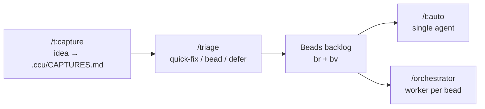
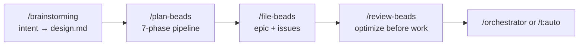

# Claude Code & Codex Utils

A shared plugin marketplace for [Claude Code](https://docs.anthropic.com/en/docs/claude-code) and [Codex](https://developers.openai.com/codex/) — reusable engineering skills and workflows organized as one installable plugin (`ccu`).

## Install

### Claude Code

In a Claude Code session:

```bash
/plugin marketplace add trungtnm/claude-code-utils
/plugin install ccu
```

### Codex

From a terminal:

```bash
codex plugin marketplace add trungtnm/claude-code-utils
codex plugin add ccu@ccu
```

Restart Codex and open a new conversation after installation. The regular
skills are available by name. Claude's `/t:name` commands are exposed to Codex
as `$t-name` skills—for example, `/t:capture` maps to `$t-capture` and
`/t:commit` maps to `$t-commit`. Open `/hooks` once to inspect and trust the
bundled read-only beads drift guard.

For local development, see [DEVELOPMENT.md](DEVELOPMENT.md).

## Compatibility

The same `SKILL.md` files and `SessionStart` hook power both products. Claude
Code additionally loads native `commands/` and `agents/`; Codex loads generated
`t-*` skill adapters for the commands and maps agent personas onto Codex
subagents. Workflows translate product-specific tool names to the current
host's user-input, planning, and collaboration tools.

See [the compatibility contract](plugins/ccu/CODEX.md) for the full mapping.

## The Core Workflow

Everything in this plugin serves one loop: **capture ideas without losing flow, triage them into beads, and let agents execute the beads autonomously.**



### 1. Capture — `/t:capture`

The most valuable habit: record every idea, bug, or observation the moment it occurs. Takes under 5 seconds, never breaks focus:

```bash
/t:capture this API should have rate limiting
/t:capture flaky test in checkout.test.ts — race condition?
/t:capture [paste image]      # saved to .ccu/captures/, summarized in text
```

Everything lands in `.ccu/CAPTURES.md` as a timestamped checklist — no analysis, no formatting, no interruption.

### 2. Triage — `/triage`

At natural breaks (between beads, end of day), classify every unchecked capture:

```bash
/triage    # each capture → quick-fix (done now) / new bead / defer / discard
```

Small fixes get done immediately; substantial ideas become beads (via [[file-beads]] templates); noise gets consciously discarded. Capture fast, triage deliberately — good ideas never slip through and you never lose flow chasing them.

### 3. Execute — `/t:auto` or `/orchestrator`

**`/t:auto`** — a single autonomous agent works through the beads backlog:

- Picks the highest-value ready bead (`br ready` + `bv`), claims it, implements with TDD, verifies (tests/lint/typecheck/build), commits per bead, closes it, and loops until nothing actionable remains.
- Detects other active agents via Agent Mail; when peers are present it runs in multi-agent mode with file reservations, otherwise solo.
- Commits land directly on your current branch; pushing is always your call.

**`/orchestrator`** — coordinated multi-agent execution for a planned epic:

- The orchestrator only coordinates, never writes code. It spawns **one worker per ready bead** (capped at 3 concurrent), driven by the `bv`/`br ready` dependency graph — closing a bead unblocks and dispatches the next wave.
- After all beads are verified, one independent **tester** agent writes functional/e2e tests against the epic's public surface, bugs bounce back to fix-scoped coders, and a **reviewer** agent does an integrated sweep + writes docs.
- Verification is objective: the orchestrator checks that a commit exists per bead, greps diffs for `mock`/`stub`/`TODO`, and confirms every commit stays inside the bead's `## Files` scope.

### Coordination: Agent Mail + Beads

All agents work in the same tree, on the current branch. Two mechanisms keep them from colliding:

- **Agent Mail file reservations** — every worker reserves its bead's `## Files` before editing and releases on completion. A failed reservation means stop and report, never proceed. Agent Mail is keyed to the repo root, so reservations from every session and epic collide correctly.
- **Beads dependencies (`br dep`, scheduled by `bv`)** — only beads whose dependencies are closed get dispatched. Beads that can run in parallel must have disjoint `## Files` sets; beads that share files are sequenced with an explicit dependency.

Commit discipline follows: agents stage named files only and commit with a pathspec (`git commit -m "..." -- <paths>`), so concurrent work in the shared index never leaks between commits.

## Planning a Feature

For anything bigger than a quick fix, plan before executing:



**`/brainstorming`** is the required front door for creative work — it explores user intent, requirements, and design *before* any implementation, and writes the agreed design to `.ccu/artifacts/<dir>/design.md`. Alternatively `/t:discuss` runs guided requirements gathering for a concrete feature.

**`/plan-beads`** runs the full planning pipeline: parallel codebase discovery → Oracle synthesis (approach + risk map) → decomposition into beads → bead review → `bv` graph validation → a bead-level execution plan (`.ccu/artifacts/<dir>/execution-plan.md` with planned files, coordination resources, integration checkpoints, entry points, and waves).

### The Beads Ecosystem

Beads are the source of truth for all work — bead IDs link to Agent Mail threads, git commits (`Bead: <id>` footer), and the dependency graph.

**`br`** (Beads Rust) is the issue tracker: types (task/bug/feature/epic), priorities (p0–p4), dependency links, JSONL sync via git. It never runs git itself — committing bead state is always explicit. Agents resolve identity via `ACTOR="${BR_ACTOR:-assistant}"`.

**`bv`** (Beads Viewer) computes graph metrics over the backlog: degree and topological sort instantly, then PageRank, betweenness, cycles, and critical path. Agents use `--robot-*` flags (`--robot-triage`, `--robot-priority`, `--robot-plan`) — bare `bv` opens a TUI that blocks automation.

**`/file-beads`** is the single source of truth for bead structure. Every bead is self-contained for a worker with zero context: project context, reasoning, executable acceptance criteria, a **`## Files`** block with the best-known production and test footprint, a **`## Coordination Resources`** block for admission, and an **`## Interfaces`** block for known cross-bead seams. Epics carry inherited `## Global Constraints` and project-specific `## Orchestration Environment` commands.

**`/review-beads`** applies the plan-space philosophy — *"changing a bead takes seconds, changing implemented code takes hours"* — checking self-documentation, interface consistency, test ownership, and file/resource conflicts between parallel-ready beads.

## Skills

Beads & workflow:

| Skill | Description |
|-------|-------------|
| `/brainstorming` | Explore intent, requirements, and design before any implementation |
| `/plan-beads` | Feature planning pipeline: discovery → approach → beads → execution plan |
| `/file-beads` | File epics and self-documented issues; owns the bead templates |
| `/review-beads` | Review, proofread, and refine filed beads |
| `/br` | Beads Rust issue tracker: create, triage, dependencies, sync |
| `/bv` | Beads Viewer: graph-aware triage (PageRank, critical path, cycles) |
| `/triage` | Classify captures into quick-fixes, beads, or deferrals |
| `/orchestrator` | Multi-agent bead execution: dispatch, monitor, verify |
| `/recipe` | Pre-built command chains (new-feature, bug-fix, quality-review) |
| `/session-state` | `.ccu/` directory: captures, decisions journal, recipe checkpoint, artifacts |

Quality & safety:

| Skill | Description |
|-------|-------------|
| `/test-driven-development` | Write-tests-first methodology |
| `/ubs` | Ultimate Bug Scanner: static analysis quality gate |
| `/dcg` | Destructive Command Guard: blocks dangerous commands pre-execution |
| `/security-review` | Security checklist for auth, input, secrets, APIs |
| `/qa-sweep` | Three-phase quality sweep (inspect, peer-review, polish) |
| `/coding-standards` | TypeScript/JavaScript/React/Node.js standards |
| `/create-project-rules` | Generate tailored quality rules for a project's CLAUDE.md |

Frontend & design:

| Skill | Description |
|-------|-------------|
| `/reactcomponents` | Convert Stitch designs into Vite/React components |
| `/ui-spec-writer` | Implementation specs from a working demo, for handoff to agents |
| `/web-design-guidelines` | Web Interface Guidelines compliance review |
| `/vercel-react-best-practices` | React/Next.js optimization guidelines |
| `/excalidraw-diagram` | Excalidraw diagrams that make visual arguments |
| `/markdown-html-viewer` | Render Markdown docs as a polished HTML viewer with Mermaid |

Knowledge & memory:

| Skill | Description |
|-------|-------------|
| `/cass` | Search session history across coding agents |
| `/cm` | Procedural memory with confidence decay and anti-pattern learning |
| `/docs-seeker` | Discover docs via llms.txt, Repomix, parallel exploration |
| `/deslopify` | Remove AI tropes and clichés from text |
| `/writing-clearly-and-concisely` | Strunk's rules applied to any prose |

## Agents

| Agent | Model | Role |
|-------|-------|------|
| **worker** | opus | Implements one assigned bead with TDD; the only role that edits production logic |
| **tester** | opus | Independent functional/integration/e2e tests against the epic, black-box |
| **reviewer** | opus | Final integrated review + documentation for what was built |
| **oracle** | — | Read-only advisory consultant for complex reasoning |
| **architect** | — | System design and scalability analysis (read-only) |
| **code-reviewer** | — | Quality, security, maintainability review |
| **security-reviewer** | — | OWASP Top 10, secrets, injection detection |
| **database-reviewer** | — | PostgreSQL/Supabase schema and query review |
| **build-error-resolver** | — | Build/type errors only, minimal diffs |
| **tdd-guide** | — | Enforces write-tests-first methodology |

Tool access is deliberately scoped per agent: reviewers and consultants read but don't edit; the worker has full access because it owns implementation.

## Commands

Session commands (`t:` prefix) are single-purpose instruction scripts. Most accept optional `$ARGUMENTS` to scope their work.

### Core loop

| Command | Purpose |
|---------|---------|
| `t:capture` | Record an idea, observation, or bug in <5 seconds |
| `t:auto` | Autonomous agent: register with Agent Mail, work through ready beads |
| `t:next` | Analyze all state, recommend the single best next action |
| `t:commit` | Commit all changes in logical groups with detailed messages |
| `t:done` | Session completion: close beads, sync state, wrap up |
| `t:init` | Check and set up prerequisite tools and project state |

### Implementation & review

| Command | Purpose |
|---------|---------|
| `t:blindspot` | Surface your unknown unknowns about a domain or module before starting work |
| `t:discuss` | Guided requirements gathering for a new feature |
| `t:peer-review` | Review code for bugs, security issues, reliability problems |
| `t:fresh-eyes` | Re-read all session code and catch bugs with fresh perspective |
| `t:random-inspect` | Randomly explore code files, trace flows, fix issues |
| `t:rootfix` | Diagnose and fix root causes — no bandaid fixes |
| `t:remove-stub` | Replace all stubs, placeholders, mocks, and TODOs with real code |
| `t:demo-to-prod` | Convert a working demo/prototype UI into a production app |
| `t:onboard` | Guide setup, running, and testing after auto dev mode completes |
| `t:quiz` | Explain a change set and quiz the user on it before merging unread code |

### Polish, docs & analysis

| Command | Purpose |
|---------|---------|
| `t:polish` | Scrutinize UI/UX and implementation quality |
| `t:performance-audit` | Find and fix performance problems |
| `t:enrich-readme` | Enrich the README with real content from the codebase |
| `t:enrich-docs` | Find undocumented functionality and document it |
| `t:reorganize` | Reorganize a target directory |

### Ideation

| Command | Purpose |
|---------|---------|
| `t:top-ideas` | Top 10 most impactful feature ideas |
| `t:idea-wizard` | Best ideas for improving the project |
| `t:opinion` | Honest, critical assessment of the project (or a target) |

## A Typical Day

```
Morning:
  /t:next                               ← "In-progress bead a02-1a2b — resume it"
  /t:auto                               ← Resumes from beads + git, completes remaining beads
  /t:capture fix the flaky test in auth.test.ts
  /t:capture [pasted image] -> check and improve the styling of CTA button
  /t:capture we need to support ZNS for messages sending
  /t:capture #more captures...

Midday:
  /triage                               ← "flaky test → quick-fix (doing now), other beads..."
  /t:next                               ← "3 ready beads. Start a02-4e5f"
  /t:auto                               ← Works through ready beads

Afternoon:
  /brainstorming add SSO support        ← Design exploration for the next feature
  /plan-beads                           ← Decompose into beads + execution plan
  /orchestrator                         ← Parallel workers, one per ready bead
  /t:commit                             ← Commit in logical groups
```

Both execution paths record verification in bead close reasons and commits, and route decisions per the session-state promote rule: ADR-worthy ones to `docs/adr/`, the rest to the `.ccu/DECISIONS.md` journal. Resume state lives in beads and git.

## How It Works

### Plugin system

| Type | Shared source | Claude Code | Codex |
|------|---------------|-------------|-------|
| **Skill** | `plugins/ccu/skills/<name>/SKILL.md` | `/skill-name` or auto-trigger | `$skill-name` or auto-trigger |
| **Command workflow** | `plugins/ccu/commands/t:<name>.md` | `/t:command-name` | `$t-command-name` adapter |
| **Agent persona** | `plugins/ccu/agents/<name>.md` | Native `Task(subagent_type=...)` | Loaded into a generic Codex subagent task when allowed |
| **Hook** | `plugins/ccu/hooks/hooks.json` | Native plugin hook | Native plugin hook; review/trust with `/hooks` |

Skill frontmatter is minimal — `name`, `description` (with trigger phrases), and optionally `model`. The body is the workflow itself: comprehensive enough to reference mid-work, not a thin wrapper.

Codex command adapters are generated from command frontmatter and link back to
the original command file, so there is one workflow to maintain. Run
`python3 scripts/sync-command-skills.py` after adding or renaming a command.

### Repository layout

```
claude-code-utils/
├── .claude-plugin/
│   └── marketplace.json        # Claude Code marketplace
├── .agents/plugins/
│   └── marketplace.json        # Codex repo marketplace
├── plugins/
│   └── ccu/                    # Shared plugin root
│       ├── .claude-plugin/     # Claude Code plugin manifest
│       ├── .codex-plugin/      # Codex plugin manifest
│       ├── skills/             # Shared skills + generated t-* adapters
│       ├── agents/             # Claude roles; Codex persona resources
│       ├── commands/           # Source t: command workflows
│       └── hooks/              # Shared Claude Code/Codex SessionStart hook
├── scripts/
│   └── sync-command-skills.py  # Keeps Codex command adapters in sync
├── DEVELOPMENT.md
└── README.md
```

### Session state (`.ccu/`)

Project-local, plain-Markdown session state: `CAPTURES.md` (ideas), `DECISIONS.md` (append-only journal of decision claims, grep-on-demand), `CHECKPOINT.md` (recipe progress, deleted on completion), and `artifacts/<dir>/` (planning docs: discovery, approach, execution plan, summary — browsable via a generated HTML index). Durable knowledge lives outside `.ccu/`: ADRs in `docs/adr/`, requirements as beads, verification in bead close reasons and commits.

## Contributing

See [DEVELOPMENT.md](DEVELOPMENT.md) for local setup and the skill authoring workflow. When adding skills, follow the existing `SKILL.md` frontmatter convention: `name`, a `description` rich in trigger phrases, and a workflow body with concrete commands.
