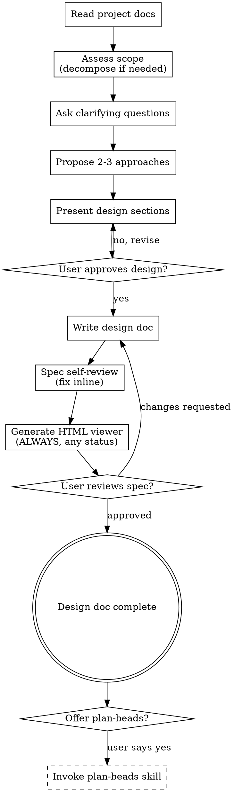

# Brainstorming Ideas Into Designs

## Overview

Help turn ideas into fully formed designs and specs through natural collaborative dialogue.

Start by understanding the current project context, then ask questions one at a time to refine the idea. Once you understand what you're building, present the design, get user approval, and write a reviewed design doc.

<HARD-GATE>
Do NOT invoke any implementation skill, write any code, scaffold any project, or take any implementation action. This skill's ONLY output is a reviewed design document. The next step after brainstorming is always [[plan-beads]] (decomposition) — and only if the user opts in. This applies to EVERY project regardless of perceived simplicity.
</HARD-GATE>

## Anti-Pattern: "This Is Too Simple To Need A Design"

Every project goes through this process. A todo list, a single-function utility, a config change — all of them. "Simple" projects are where unexamined assumptions cause the most wasted work. The design can be short (a few sentences for truly simple projects), but you MUST present it and get approval.

## Checklist

You MUST create a task for each of these items and complete them in order:

1. **Explore project context** — check files, docs, recent commits.
2. **Assess scope** — if the request spans multiple independent subsystems, decompose into sub-projects before refining details (see Scope Assessment)
3. **Offer the visual companion just-in-time** — NOT upfront. The first time a question would genuinely be clearer shown than described, offer it then (its own message). If no visual question ever arises, never offer it. See the Visual Companion section.
4. **Ask clarifying questions** — one at a time, understand purpose/constraints/success criteria
5. **Propose 2-3 approaches** — with trade-offs and your recommendation
6. **Present design** — in sections scaled to their complexity, get user approval after each section
7. **Write design doc** — save to `.ccu/artifacts/<date>-draft-<slug>/design.md` (no git commit — `.ccu/artifacts/` is gitignored)
8. **Spec self-review** — fresh-eyes inline check for placeholders, contradictions, ambiguity, scope (see Spec Self-Review)
9. **Generate the HTML viewer** — ALWAYS, regardless of approval status; regenerate after every edit (see Generate the browsable index)
10. **User reviews written spec** — ask the user to review the rendered design before proceeding (see User Review Gate)
11. **Offer planning** (optional) — ask if the user wants to invoke [[plan-beads]] to decompose the design into Beads

## Process Flow



**The terminal state is a reviewed design doc.** After the user approves the written spec, ask if they'd like to invoke [[plan-beads]] to decompose the design into Beads. Do NOT automatically invoke any implementation or plan-beads skill — only proceed if the user explicitly opts in.

## Phase 1: Read Before You Think

Before asking any questions or proposing anything, you MUST thoroughly read the project's foundational documents. This is non-negotiable — you cannot brainstorm effectively without understanding the project's identity, conventions, and constraints.

**Required reads (in order, skip if file doesn't exist):**
1. `README.md` — project purpose, tech stack, how it works
2. `AGENTS.md` and `CLAUDE.md` — AI agent instructions, coding conventions, and project-specific rules (read either or both when present)
3. `AGENTS.md` — multi-agent coordination patterns, if applicable
4. `docs/` directory — scan for existing design docs, architecture notes, ADRs
5. `package.json` / `Cargo.toml` / `pyproject.toml` — dependencies, scripts, project metadata
6. Recent git commits (`git log --oneline -20`) — what's been happening lately

**Why this matters:** Without reading these docs, you will propose designs that contradict existing conventions, duplicate existing functionality, or ignore constraints the project already established. The user should not have to re-explain what's already documented.

**After reading, summarize what you learned** in 2-3 sentences before moving on. This confirms your understanding and gives the user a chance to correct any misinterpretation.

## Scope Assessment (before refining details)

Before spending questions on details, assess the size of the request:

- If it describes multiple independent subsystems (e.g., "build a platform with chat, file storage, billing, and analytics"), **flag this immediately.** Don't refine the details of a project that needs to be decomposed first.
- If the project is too large for a single design, help the user decompose into sub-projects: what are the independent pieces, how do they relate, what order should they be built? Then brainstorm the **first** sub-project through the normal design flow. Each sub-project gets its own design → plan-beads → implementation cycle.
- For appropriately-scoped projects, continue straight to clarifying questions.

This mirrors the epic-driven flow: a multi-subsystem request is an *epic*, and each sub-project is a design doc that [[plan-beads]] later turns into a bead track.

## The Process

**Understanding the idea:**
- Check out the current project state first (files, docs, recent commits)
- Before asking detailed questions, assess scope: if the request describes multiple independent subsystems (e.g., "build a platform with chat, file storage, billing, and analytics"), flag this immediately. Don't spend questions refining details of a project that needs to be decomposed first.
- If the project is too large for a single spec, help the user decompose into sub-projects: what are the independent pieces, - how do they relate, what order should they be built? Then brainstorm the first sub-project through the normal design flow. - Each sub-project gets its own spec → plan → implementation cycle.
- For appropriately-scoped projects, ask questions one at a time to refine the idea
- Prefer multiple choice questions when possible, but open-ended is fine too
- Only one question per message - if a topic needs more exploration, break it into multiple questions
- Focus on understanding: purpose, constraints, success criteria

**Exploring approaches:**
- Propose 2-3 different approaches with trade-offs
- Present options conversationally with your recommendation and reasoning
- Lead with your recommended option and explain why

**Presenting the design:**
- Once you believe you understand what you're building, present the design
- Scale each section to its complexity: a few sentences if straightforward, up to 200-300 words if nuanced
- Ask after each section whether it looks right so far
- Cover: architecture, components, data flow, error handling, testing
- Be ready to go back and clarify if something doesn't make sense

**Design for isolation and clarity:**
- Break the system into smaller units that each have one clear purpose, communicate through well-defined interfaces, and can be understood and tested independently
- For each unit, you should be able to answer: what does it do, how do you use it, and what does it depend on?
- Can someone understand what a unit does without reading its internals? Can you change the internals without breaking consumers? If not, the boundaries need work.
- Smaller, well-bounded units are also easier to work with — you reason better about code you can hold in context at once, and edits are more reliable when files are focused. A file growing large is often a signal it's doing too much.

**Working in existing codebases:**
- Explore the current structure before proposing changes. Follow existing patterns.
- Where existing code has problems that affect the work (a file that's grown too large, unclear boundaries, tangled responsibilities), include targeted improvements as part of the design — the way a good developer improves code they're working in.
- Don't propose unrelated refactoring. Stay focused on what serves the current goal.

## Visual Companion

A browser-based companion for showing mockups, diagrams, and visual options during brainstorming. Available as a tool — not a mode. Accepting the companion means it's available for questions that benefit from visual treatment; it does NOT mean every question goes through the browser.

**Offering the companion (just-in-time):** Do NOT offer it upfront. Wait until a question would genuinely be clearer shown than told — a real mockup / layout / diagram question, not merely a UI *topic*. The first time that happens, offer it then, as its own message:
> "This next part might be easier if I show you — I can put together mockups, diagrams, and comparisons in a browser tab as we go. It's still new and can be token-intensive. Want me to? I'll open it for you."

**This offer MUST be its own message.** Only the offer — no clarifying question, summary, or other content. Wait for the user's response. If they accept, start the server with `--open` so their browser opens to the first screen automatically. If they decline, continue text-only and don't offer again unless they raise it.

**Per-question decision:** Even after the user accepts, decide FOR EACH QUESTION whether to use the browser or the terminal. The test: **would the user understand this better by seeing it than reading it?**

- **Use the browser** for content that IS visual — mockups, wireframes, layout comparisons, architecture diagrams, side-by-side visual designs
- **Use the terminal** for content that is text — requirements questions, conceptual choices, tradeoff lists, A/B/C/D text options, scope decisions

A question about a UI topic is not automatically a visual question. "What does personality mean in this context?" is conceptual — use the terminal. "Which wizard layout works better?" is visual — use the browser.

If the user accepts the companion, read the detailed guide before proceeding:
`${CLAUDE_PLUGIN_ROOT}/skills/brainstorming/visual-companion.md`

Session mockups persist under `.ccu/brainstorm/` (gitignored, like other ephemeral `.ccu/` scratch). The server (`scripts/server.cjs`) needs Node.js.

## After the Design

**Documentation (required):**
- Write the validated design to `.ccu/artifacts/<date>-draft-<slug>/design.md`
  - `<date>` is today in `YYYY-MM-DD` format
  - `<slug>` is a kebab-case 3-5 word topic identifier
  - The `draft-` placeholder gets replaced with the real epic ID by [[plan-beads]] (Phase 3) — brainstorming runs before any beads exist, so it can't know the epic ID yet
- Write it under [[tech-doc]] with `doc-type: design` — problem and constraints → chosen design → interfaces and data flow → trade-offs and rejected options → open questions. It owns the prose: no AI voice, no filler, exact identifiers in backticks, `TODO:` where a fact is still unknown rather than plausible-sounding filler. The design doc is the one place where rejected alternatives belong, so `tech-doc`'s "No history" rule applies to the *system*, not to the options you considered.
- **Do NOT run `git commit`.** `.ccu/artifacts/` is gitignored — the design doc is a local working file, not a committed artifact.
- **Route the durable "why" before ending** (the design doc dies gitignored, so this step is what preserves it): for each decision the approved design settles, apply the promote rule in [[session-state]] — decisions meeting the [[grill-with-docs]] ADR gate get `docs/adr/NNNN-slug.md` + a one-line `.ccu/DECISIONS.md` pointer; below-gate decisions (including the rejected alternatives worth remembering) get a journal entry in the shared schema.

**Spec Self-Review (required):**
After writing the design doc, look at it with fresh eyes:

1. **Placeholder scan:** Any "TBD", "TODO", incomplete sections, or vague requirements? Fix them.
2. **Internal consistency:** Do any sections contradict each other? Does the architecture match the feature descriptions?
3. **Scope check:** Is this focused enough for a single [[plan-beads]] decomposition, or does it need to be split (see Scope Assessment)?
4. **Ambiguity check:** Could any requirement be interpreted two different ways? If so, pick one and make it explicit.

Fix any issues inline. No need to re-review — just fix and move on. For large or high-risk designs, escalate to a subagent reviewer using `spec-document-reviewer-prompt.md`.

**Generate the browsable index (required — ALWAYS, regardless of approval status):**
Immediately after the self-review — **before** the User Review Gate and independent of whether the design is approved, draft, or still being revised — build the HTML viewer so it reads cleanly with live Mermaid, TOC, and callouts (and switches to any docs [[plan-beads]] adds later to the same directory):
```bash
python3 "${CLAUDE_PLUGIN_ROOT}/skills/markdown-html-viewer/scripts/md2html.py" .ccu/artifacts/<date>-draft-<slug>/
```
Directory + default fetch mode (no `--inline`, no build questions — the automated exception documented in [[session-state]]). Point the user at the resulting `index.html`, opened via `open_in_dev_browser.sh`.

**Force this step every time.** Do NOT gate it on user approval, design status, perceived simplicity, or "the doc might still change." The rendered HTML is *how* the user reviews the design (the Mermaid flow, tables, and callouts are far more legible than raw Markdown), so it must exist **before** they review. **Regenerate it after every edit** — each time you revise the design doc during the review loop, re-run the command so the HTML never lags the Markdown.

**User Review Gate (required):**
After the HTML is generated, ask the user to review the design — pointing them at the rendered page:

> "Design doc written to `<path>`, rendered at `<path>/index.html` (open it for the Mermaid diagram + tables). Please review it and let me know if you want any changes before we decompose it into beads."

Wait for the user's response. If they request changes, make them, re-run the self-review, **and regenerate the HTML viewer** (above). Only proceed once the user approves.

**The approved design doc + its rendered HTML is the terminal deliverable of brainstorming.**

**Planning (optional — user must opt in):**
- After the design doc is approved and the index is generated, ask: "Would you like me to invoke [[plan-beads]] to decompose this design into Beads for implementation tracking?"
- Only invoke [[plan-beads]] if the user explicitly says yes
- Do NOT automatically proceed to [[plan-beads]] or any other implementation skill
- [[plan-beads]] will reuse the same `.ccu/artifacts/<date>-draft-<slug>/` directory and rename it to `<date>-<epic-id>-<slug>/` once the epic is created

## Key Principles

- **One question at a time** - Don't overwhelm with multiple questions
- **Multiple choice preferred** - Easier to answer than open-ended when possible
- **YAGNI ruthlessly** - Remove unnecessary features from all designs
- **Explore alternatives** - Always propose 2-3 approaches before settling
- **Incremental validation** - Present design, get approval before moving on
- **Decompose big requests** - Multiple subsystems become sub-projects, each with its own design → plan cycle
- **Show, don't just tell** - Reach for the visual companion when a question is genuinely visual
- **Review before handoff** - Self-review the spec, then let the user review it, before decomposing
- **Be flexible** - Go back and clarify when something doesn't make sense
