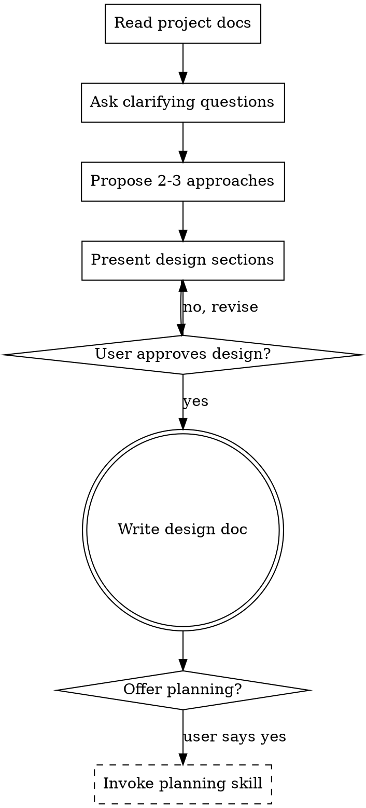

# Brainstorming Ideas Into Designs

## Overview

Help turn ideas into fully formed designs and specs through natural collaborative dialogue.

Start by understanding the current project context, then ask questions one at a time to refine the idea. Once you understand what you're building, present the design and get user approval.

<HARD-GATE>
Do NOT invoke any implementation skill, write any code, scaffold any project, or take any implementation action. This skill's ONLY output is a design document. This applies to EVERY project regardless of perceived simplicity.
</HARD-GATE>

## Anti-Pattern: "This Is Too Simple To Need A Design"

Every project goes through this process. A todo list, a single-function utility, a config change — all of them. "Simple" projects are where unexamined assumptions cause the most wasted work. The design can be short (a few sentences for truly simple projects), but you MUST present it and get approval.

## Checklist

You MUST create a task for each of these items and complete them in order:

1. **Read project docs** — carefully read README.md, CLAUDE.md, AGENTS.md, docs/, and recent commits before doing anything else
2. **Ask clarifying questions** — one at a time, understand purpose/constraints/success criteria
3. **Propose 2-3 approaches** — with trade-offs and your recommendation
4. **Present design** — in sections scaled to their complexity, get user approval after each section
5. **Write design doc** — save to `docs/plans/YYYY-MM-DD-<topic>-design.md` and commit
6. **Offer planning** (optional) — ask if the user wants to invoke the planning skill to decompose the design into Beads

## Process Flow

**The terminal state is writing the design doc.** After committing the design doc, ask the user if they'd like to invoke the planning skill to decompose the design into Beads. Do NOT automatically invoke any implementation or planning skill — only proceed if the user explicitly opts in.

## Phase 1: Read Before You Think

Before asking any questions or proposing anything, you MUST thoroughly read the project's foundational documents. This is non-negotiable — you cannot brainstorm effectively without understanding the project's identity, conventions, and constraints.

**Required reads (in order, skip if file doesn't exist):**
1. `README.md` — project purpose, tech stack, how it works
2. `CLAUDE.md` — AI agent instructions, coding conventions, project-specific rules
3. `AGENTS.md` — multi-agent coordination patterns, if applicable
4. `docs/` directory — scan for existing design docs, architecture notes, ADRs
5. `package.json` / `Cargo.toml` / `pyproject.toml` — dependencies, scripts, project metadata
6. Recent git commits (`git log --oneline -20`) — what's been happening lately

**Why this matters:** Without reading these docs, you will propose designs that contradict existing conventions, duplicate existing functionality, or ignore constraints the project already established. The user should not have to re-explain what's already documented.

**After reading, summarize what you learned** in 2-3 sentences before moving on. This confirms your understanding and gives the user a chance to correct any misinterpretation.

## The Process

**Understanding the idea:**
- You've already read the project docs in Phase 1 — now build on that context
- Ask questions one at a time to refine the idea
- Prefer multiple choice questions when possible, but open-ended is fine too
- Only one question per message - if a topic needs more exploration, break it into multiple questions
- Focus on understanding: purpose, constraints, success criteria

**Exploring approaches:**
- Propose 2-3 different approaches with trade-offs
- Present options conversationally with your recommendation and reasoning
- Lead with your recommended option and explain why

**Presenting the design:**
- Once you believe you understand what you're building, present the design
- Scale each section to its complexity: a few sentences if straightforward, up to 200-300 words if nuanced
- Ask after each section whether it looks right so far
- Cover: architecture, components, data flow, error handling, testing
- Be ready to go back and clarify if something doesn't make sense

## After the Design

**Documentation (required):**
- Write the validated design to `docs/plans/YYYY-MM-DD-<topic>-design.md`
- Use elements-of-style:writing-clearly-and-concisely skill if available
- Commit the design document to git
- **This is the terminal deliverable of brainstorming.**

**Planning (optional — user must opt in):**
- After the design doc is committed, ask: "Would you like me to invoke the planning skill to decompose this design into Beads for implementation tracking?"
- Only invoke the planning skill if the user explicitly says yes
- Do NOT automatically proceed to planning or any other implementation skill

## Key Principles

- **One question at a time** - Don't overwhelm with multiple questions
- **Multiple choice preferred** - Easier to answer than open-ended when possible
- **YAGNI ruthlessly** - Remove unnecessary features from all designs
- **Explore alternatives** - Always propose 2-3 approaches before settling
- **Incremental validation** - Present design, get approval before moving on
- **Be flexible** - Go back and clarify when something doesn't make sense