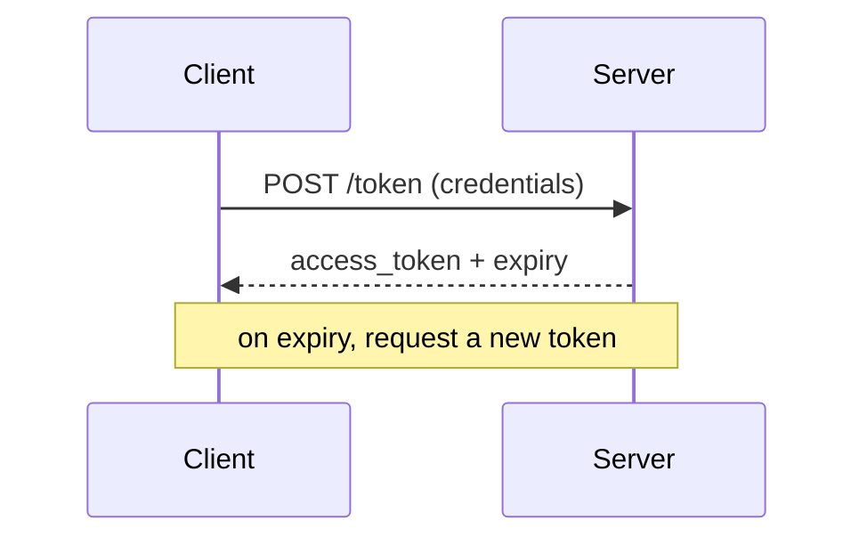
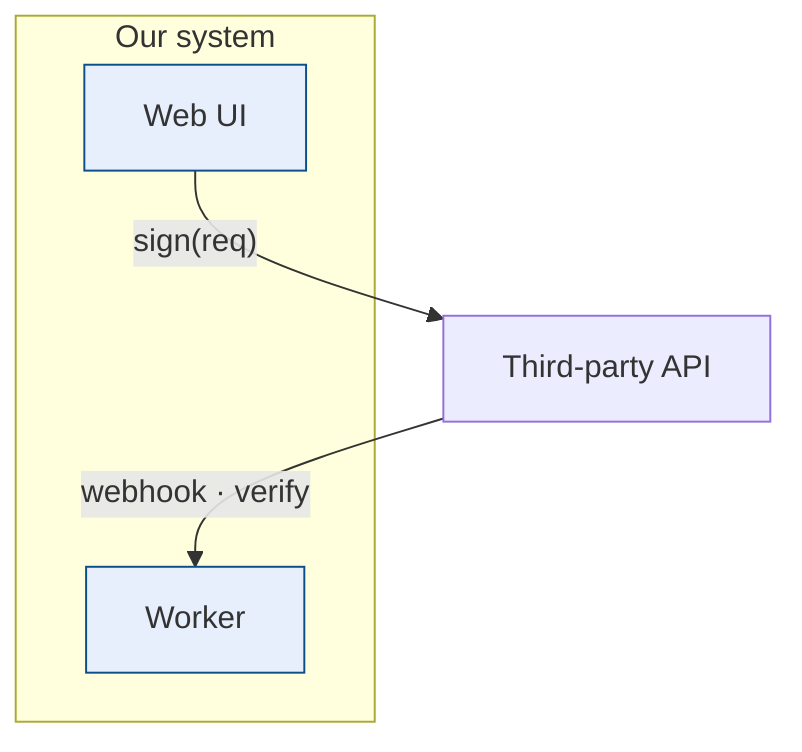
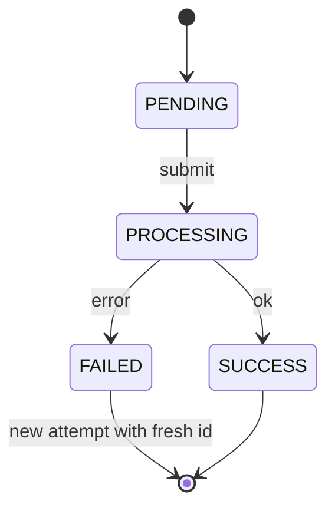
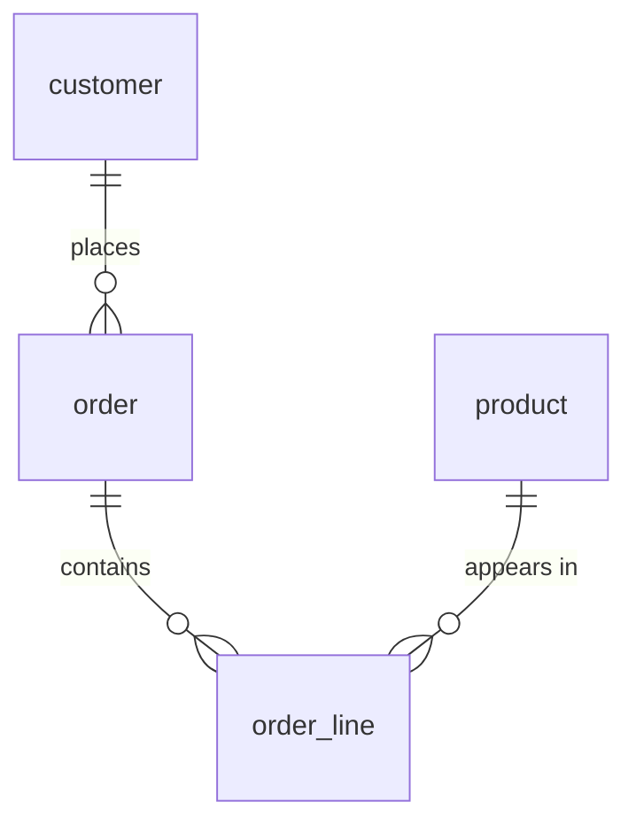

# Readability playbook: Mermaid vs. tables vs. code

The goal of a document viewer is for a reader to *find and absorb* information fast. Prose hides
structure: a sequence reads as a numbered list, a data model reads as a wall of SQL, a parameter
list reads as a run-on sentence full of inline-code chips. The fix is to match each piece of
content to the representation that makes its structure visible — then the styled viewer does the rest.

Three representations, and when each wins:

- **Mermaid diagram** — when the meaning *is* the structure: order, branching, state, relationships, flow.
- **Table** — when there are repeated records with the same fields: parameters, columns, options, comparisons.
- **Code block** — when the content is a *literal artifact* that must be reproduced exactly. Do **not** "upgrade" these; a diagram of a signature string or a JSON body loses the very fidelity that makes it useful.

## Contents
- [Decision guide](#decision-guide)
- [Mermaid recipes](#mermaid-recipes)
- [Mermaid parser-safety (read before debugging a missing diagram)](#mermaid-parser-safety)
- [Table recipes](#table-recipes)
- [Leave-it-as-code](#leave-it-as-code)
- [Verifying](#verifying)

## Decision guide

Ask "what is this content, really?":

| If the content is… | Use | Notes |
|---|---|---|
| Steps with actors talking to each other (API call, auth handshake, webhook) | `sequenceDiagram` | one lifeline per actor |
| Steps without actors (a pipeline, a decision tree) | `flowchart` | `TB` or `LR` |
| A thing that moves between states (order status, job lifecycle) | `stateDiagram-v2` | transitions are the payload |
| Entities and their relationships (DB schema, domain model) | `erDiagram` + per-entity tables | diagram for relations, tables for fields |
| Boxes-and-arrows architecture (who calls whom, where data flows) | `flowchart` with `subgraph` + `classDef` | replaces ASCII art that overflows |
| A list of fields/params/options each with the same attributes | table | `Field \| Req \| Len \| Notes` etc. |
| A wide `CREATE TABLE` or column dump | table(s) | one per entity; add an `erDiagram` for relations |
| A literal string, ID, token, JSON/YAML body, math formula, real code | fenced code block | reproduce verbatim; never diagram it |
| Genuinely a paragraph of reasoning | leave as prose | not everything needs a shape |

## Mermaid recipes

Copy-paste skeletons. Keep labels short; put detail in surrounding prose or a following table.

**Sequence (handshakes, request/response, webhooks):**
````markdown

````

**Flowchart (architecture; color-code with classDef):**
````markdown

````

**State machine (status lifecycle):**
````markdown

````

**ER diagram (data model relationships) — pair with field tables below:**
````markdown

````

## Mermaid parser-safety

A single bad character makes a diagram silently fail to render (it just doesn't appear). The most
common culprits, learned the hard way:

- **No literal `→` (or other arrow glyphs) in `sequenceDiagram` / `stateDiagram` labels.** It breaks
  the parser. Write the word: `map account_number to loan`, not `account_number→loan`.
- **Go easy on `()` and `,` in `stateDiagram` transition labels.** `A --> B: retry (same id, then poll)`
  can choke. Prefer plain text: `A --> B: retry with new id`.
- **Use `<br/>` for line breaks in `flowchart` node labels**, and wrap edge labels in quotes when they
  contain spaces or punctuation: `A -->|"create VA · sign(req)"| B`.
- **`erDiagram` relationship labels**: keep them one word, or quote them: `product ||--o{ line : "appears in"`.

When a diagram is missing, assume a label problem first. Validate the single diagram in isolation:
```bash
# write the ```mermaid``` body to a .mmd, then:
npx -y @mermaid-js/mermaid-cli -i diagram.mmd -o /tmp/out.svg
# no bundled Chromium? point puppeteer at a system Chrome:
#   echo '{"executablePath":"/Applications/Google Chrome.app/Contents/MacOS/Google Chrome","args":["--no-sandbox"]}' > /tmp/p.json
#   npx -y @mermaid-js/mermaid-cli -p /tmp/p.json -i diagram.mmd -o /tmp/out.svg
```

## Table recipes

**Field / parameter lists** — the highest-value transform. Dense prose like
`merchant_code (Y,20), account_name (Y,50), map_id (Y,250 — ID or contract), ...` becomes:

```markdown
| Field | Req | Len | Notes |
|---|---|---|---|
| `merchant_code` | Y | 20 | |
| `account_name` | Y | 50 | |
| `map_id` | Y | 250 | customer ID or contract code |
```

**Define a repeated response/object once, reference it.** If many endpoints return the same shape,
make one "X response object" table and have the others say "Output: X response object (§N)". Less
repetition, less scrolling.

**Data models** — replace a wide `CREATE TABLE` dump (which scrolls off-screen and gets cut off)
with an `erDiagram` for relationships plus one compact table per entity:

```markdown
| Column | Type | Key | Notes |
|---|---|---|---|
| `id` | bigint | PK | |
| `customer_id` | bigint | FK | → customer |
| `status` | string | | OPEN \| CLOSED |
```

Tip: escape pipes inside cells as `\|` (e.g. enum values `OPEN \| CLOSED`).

## Leave-it-as-code

Resist the urge to "improve" these — turning them into a diagram or table corrupts them:

- **Literal signature/INPUT strings, IDs, hashes** — must be reproduced character-for-character.
- **JSON / YAML request & response bodies** — keep as ` ```json ` so structure and quoting survive.
- **Formulas** (`openssl_sign(...)`, math) — literal.
- **Real source code or pseudocode** — code is the right representation; if its *control flow* is
  worth visualizing, *add* a flowchart/state diagram alongside it rather than replacing it.

If you catch yourself drawing a box that just contains a literal string, stop — that's a sign the
content wanted to stay code.

## Verifying

After restructuring, confirm it reads better and nothing broke:

- **No horizontal overflow.** The thing tables fix is content getting cut off at the right edge — a
  quick screenshot at a normal width confirms tables wrap and diagrams fit.
- **Every Mermaid diagram rendered as an SVG**, not raw code text. In a headless check, assert the
  count of `.content .mermaid svg` equals the number of ` ```mermaid ` fences.
- **No `pageerror`s** in the console when the page loads.

A before/after screenshot is the fastest way to confirm the document is genuinely easier to read —
which is the whole point.
